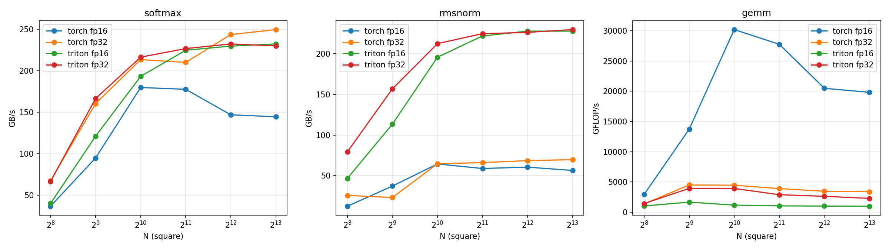
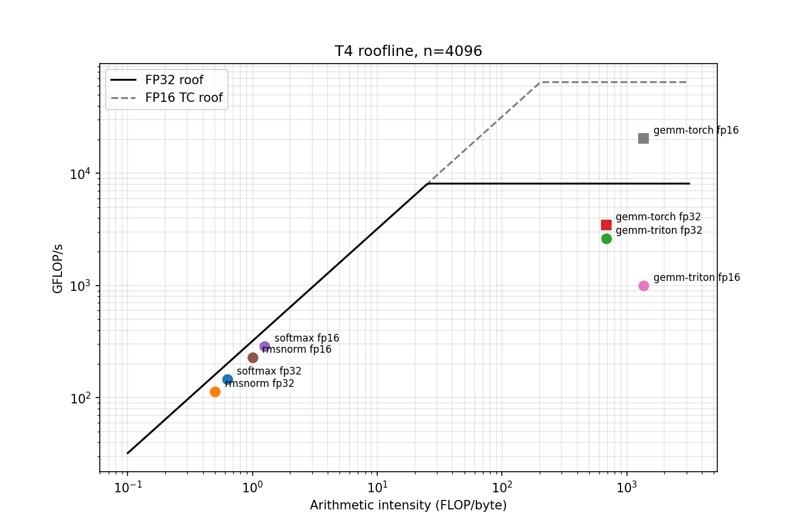

# Triton Inference Kernels: Softmax, RMSNorm, GEMM across T4 and A100

Three Transformer inference kernels written from scratch in [Triton](https://github.com/triton-lang/triton) — row-wise **softmax**, **RMSNorm**, and **tiled GEMM** — benchmarked against PyTorch/cuBLAS baselines at FP32 and FP16 on an NVIDIA T4 (Turing, sm_75) and an A100 SXM (Ampere, sm_80), with roofline analysis and a documented attempt to run the identical code on an AMD MI300X.

**Headline findings:**

- The fused row-wise kernels (softmax, RMSNorm) reach **~72% of peak HBM bandwidth on T4 and ~82% on A100**, and are up to **5× faster than unfused PyTorch ops** — with the same unchanged source on both GPUs.
- The tiled GEMM reaches **96% of cuBLAS throughput at FP32 (IEEE) on the A100** with a single untuned block configuration.
- The same FP16 GEMM source compiles to **zero tensor-core (`mma`) instructions on the T4 but 8 `mma` instructions on the A100**, verified by inspecting generated PTX — a **30× jump (2.4 → 73 TFLOP/s)** from a compiler codegen difference, not a code change.
- Cross-vendor portability to AMD was blocked entirely by environment provisioning, never by kernel code: four MI300X cloud instances failed four different ways before any kernel could run (see [friction-log.md](friction-log.md)).

## Repo layout

```
kernels/      softmax.py, rmsnorm.py, gemm.py — standalone modules, each with a self-test
results/      raw benchmark CSVs (kernel, impl, size, median ms) per GPU and dtype
plots/        performance curves and roofline (T4)
notebook_full_history.ipynb   full development history including debugging sessions
friction-log.md               everything that confused, surprised, or broke
```

## Results

All numbers are median kernel times from `triton.testing.do_bench` (warmed up, ~100 ms of repetitions) on square inputs of size N. Triton kernels use one **fixed configuration across all GPUs and sizes** (GEMM: BLOCK 64×64×32, default `num_warps`) — deliberately untuned, to measure portability of a single source. Baselines: `torch.softmax`, an unfused PyTorch RMSNorm reference, and `torch.matmul` (cuBLAS). Full sweeps (N = 256 … 8192) are in `results/`.

### T4 (16 GB, ~320 GB/s, 8.1 TFLOP/s FP32, 65 TFLOP/s FP16 tensor core)

| Kernel, N=8192 | dtype | Triton (ms) | PyTorch (ms) | Triton achieved |
|---|---|---:|---:|---|
| softmax | FP32 | 2.340 | 2.163 | 229 GB/s (72% of peak BW) |
| softmax | FP16 | 1.154 | 1.856 | 233 GB/s — 1.6× faster than torch |
| RMSNorm | FP32 | 2.340 | 7.731 | 229 GB/s — 3.3× faster than unfused torch |
| RMSNorm | FP16 | 1.178 | 4.763 | 228 GB/s — 4.0× faster |
| GEMM | FP32 | 460.7 | 309.6 | 2,387 GFLOP/s (67% of cuBLAS) |
| GEMM | FP16 | 1,135.8 | 55.5 | 968 GFLOP/s (see tensor-core finding below) |

### A100 SXM (80 GB, ~2,039 GB/s, 19.5 TFLOP/s FP32, 312 TFLOP/s FP16 tensor core)

| Kernel, N=8192 | dtype | Triton (ms) | PyTorch (ms) | Triton achieved |
|---|---|---:|---:|---|
| softmax | FP32 | 0.321 | 0.448 | 1,672 GB/s (82% of peak BW) |
| softmax | FP16 | 0.168 | 0.454 | 1,598 GB/s — 2.7× faster than torch |
| RMSNorm | FP32 | 0.322 | 1.167 | 1,667 GB/s — 3.6× faster than unfused torch |
| RMSNorm | FP16 | 0.167 | 0.819 | 1,607 GB/s — 4.9× faster |
| GEMM (IEEE FP32) | FP32 | 59.5 | 57.3 | 18.5 TFLOP/s (**96% of cuBLAS**) |
| GEMM | FP16 | 15.0 | 4.3 | 73.3 TFLOP/s (28% of cuBLAS; cuBLAS hits 83% of peak) |



The memory-bound kernels behave exactly as theory predicts: going FP32 → FP16 halves bytes per element and almost exactly halves runtime on both GPUs, while achieved GB/s stays pinned near the same fraction of peak. The RMSNorm speedups over PyTorch are a **fusion win** — the baseline is unfused torch ops that make several passes over HBM, while the Triton kernel reads and writes each element exactly once. (A note on scaling: the one-program-per-row design holds an entire row in registers, which costs occupancy at very large rows — on the T4, `torch.softmax` overtakes this kernel at N ≥ 8192 columns. The effect nearly disappears on the A100's larger register file.)

## The tensor-core finding

On the T4, the FP16 GEMM was *slower* than FP32 — a symptom, not a tuning problem. Dumping the compiled PTX via `kernel.warmup(...).asm["ptx"]` and counting instructions:

| GPU | arch | `mma` instructions | `fma` instructions | FP16 GEMM |
|---|---|---:|---:|---:|
| T4 | sm_75 (Turing) | **0** | 512 | 2.4 TFLOP/s* |
| A100 | sm_80 (Ampere) | **8** | 0 | 73.3 TFLOP/s |

*best tuned config (num_warps=8); the default config in the CSV is slower still.

Triton (3.6 on the T4 setup) never lowers FP16 `tl.dot` to tensor-core `mma` instructions on sm_75 — confirmed with a minimal, mask-free, single-tile dot kernel, ruling out anything in this repo's kernel code. The hardware is capable (cuBLAS FP16 reaches ~20 TFLOP/s on the same T4). On sm_80, the identical source emits `mma` and gains 30×. This was logged as a prediction on the T4 ("same code should emit mma on Ampere") before the A100 run confirmed it.

A second, subtler portability catch: on Ampere, FP32 `tl.dot` silently defaults to **TF32** (10-bit mantissa), so correctness checks that passed on the T4 failed on the A100 against cuBLAS until `input_precision="ieee"` was set. Portability isn't just "does it run" — it's "does it compute the same thing."

## Roofline (T4)



At N=4096: softmax (AI ≈ 0.6 FLOP/byte) and RMSNorm (AI ≈ 0.5) sit just under the memory roof — near-optimal for their intensity; no amount of code cleverness moves them right of the ridge point (~25 FLOP/byte). GEMM (AI ≈ 683) sits well right of the ridge, i.e. compute-bound territory, at ~30% of the FP32 roof. cuBLAS FP16 floats *above* the FP32 roof entirely — only possible on the tensor-core roof the Triton kernel cannot reach on this GPU.

## Cross-vendor: the MI300X attempt

The point of Triton is vendor portability, so the plan included AMD's MI300X. The kernels never got to run — four rented instances failed four independent ways, all environmental: (1) capacity unavailable; (2) instance provisioned with a CUDA PyTorch image that cannot address AMD hardware; (3) a stale ROCm image (torch 2.4-dev, May 2024) shipping **no Triton at all**, where pip-installing Triton hit a HIP runtime-library mismatch and dependency resolution silently replaced the ROCm torch with a CUDA build; (4) a modern AMD-official image with no notebook server and failed SSH key injection.

The honest conclusion from this sample: as of mid-2026, the practical barrier to cross-vendor Triton work is not the kernel language — it's that rented AMD environments do not reliably ship a working, version-matched torch+Triton pair, while both NVIDIA instances worked within minutes. Full blow-by-blow in [friction-log.md](friction-log.md).

## Limitations

The GEMM uses one fixed block configuration everywhere; a small config sweep on the T4 showed `num_warps` alone is worth ~20× at FP16, so the cross-GPU tables understate what per-GPU tuning would achieve — that is the point of holding config constant, but it means these are not "best achievable" numbers. The FP16 GEMM gap to cuBLAS on A100 (28%) is unexplored tuning headroom (block shapes, `num_stages` pipelining, swizzling). The RMSNorm baseline is unfused torch ops, not a fused library kernel. Attention, quantization, and autotuning are out of scope by design. The standalone files in `kernels/` were extracted from the verified notebook and syntax-checked, but the extracted files themselves should be re-verified on GPU (`python kernels/gemm.py` etc.) — the identical code passed all correctness gates on both GPUs.

## Reproduce

```bash
git clone https://github.com/Gavin-Morris-04/triton-inference-kernels.git
cd triton-inference-kernels
pip install torch triton   # any recent CUDA build; tested: torch 2.11/triton 3.6 (T4), torch 2.8/triton 3.4 (A100)

# correctness (any CUDA GPU):
python kernels/softmax.py
python kernels/rmsnorm.py
python kernels/gemm.py
```

Benchmarks: run the sweep cells in `notebook_full_history.ipynb` (sections are labeled); they write CSVs matching the format in `results/`. Correctness gates: `torch.allclose` vs `torch.softmax` / an unfused RMSNorm reference / `torch.matmul`, on shapes including non-power-of-two and non-block-multiple sizes (e.g. 781 columns, 517×389×731 GEMM).

## License

MIT
